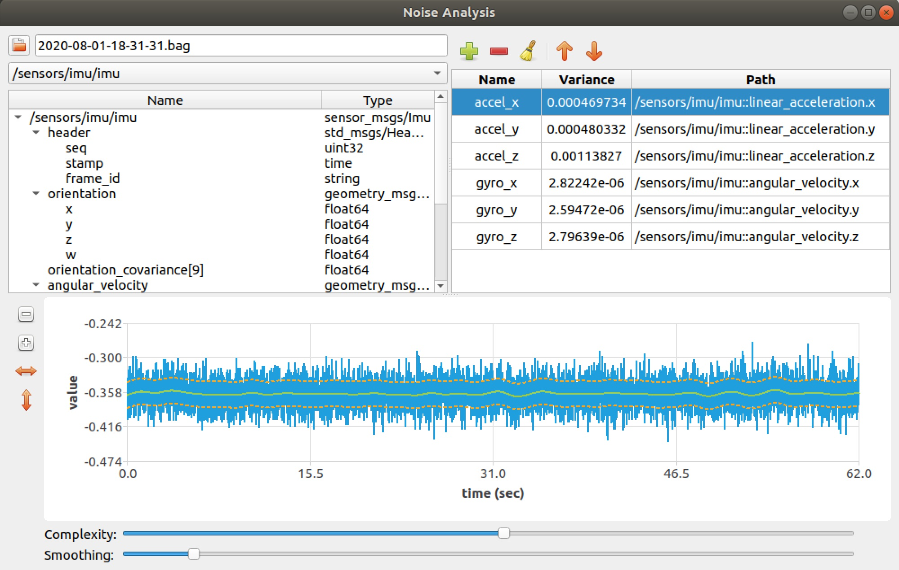

# noise_analysis

A tool for measuring the variance of noise in sensor data streams. The outputs of this tool can be used to generate sensor noise covariance (R) matrices for filters such as the Kalman Filter.



**Contents**
1. [Overview](#overview) - A description of the Noise Analysis tool.
2. [Building](#building) - Instructions for building this package.
3. [Usage](#usage) - Instructions for using the Noise Analysis tool.

# Overview

This package provides a tool for measuring and analyzing the noise characteristics of sensor data for inclusion in filters such as the Kalman Filter. Users can record sensor data into a ROS bag, load the bag in the tool, and measure the variance of sensor noise. The measured variance values can then be incorporated into noise covariance matrices.

**Features:**
- Can read data from any ROS topic and message type.
- Plots sensor data and noise estimates so you can verify accuracy.
- Noise can be measured for dynamic sensor measurments - signal does not need to be "flat".

# Building

First, ensure that the following dependencies are installed:
- [Qt5 Core](https://doc.qt.io/qt-5/qtcore-index.html): Qt5 core libraries and headers.
- [Qt5 Charts](https://doc.qt.io/qt-5/qtcharts-index.html): Qt5 charts libraries and headers.
- [message_introspection](https://github.com/pcdangio/ros_message_introspection): A ROS package library for reading any type of ROS message.
- [ALGLIB](https://www.alglib.net/): A library for performing curve fitting.

Next, download this package into your ROS workspace:
```
cd ~/my_ros_workspace/src
git clone https://github.com/pcdangio/ros-noise_analysis.git noise_analysis
```

Finally, you can build the package:
```
cd ~/my_ros_workspace
catkin_make
```

# Usage

First, launch the tool with:
```
roslaunch noise_analysis noise_analysis.launch
```

The following steps outline the general workflow of using the noise analysis tool:
1. **Record Bag**: Record sensor data from your robot/system to a [ROS bag](http://wiki.ros.org/rosbag/Commandline) file so that it may be loaded into the tool.
    - Recall that the tool can analyze noise for nonstationary signals. The sensed value does not need to be held stationary.
2. **Load Bag**: Load the bag into the tool at the top left of the window. Once loaded, the bag name will show up in the text box and it's topics will appear in the drop-down underneath.
3. **Select Topic**: Select a desired topic to read sensor data from using the drop-down box underneath the bag name. Once a topic is selected, it's message structure will appear in the tree view underneath.
4. **Select Field**: Select a desired field from the topic's message to analyze noise characteristics for. Once you have a field selected, click on the *Add* button above the data table on the top right of the window. This will add the field to the data table for analysis.
    - Only [primitive ROS types](http://wiki.ros.org/msg) can be selected and analyzed.
    - If the field you select is part of an array, a window will pop up asking for which array indices to use.
    - If the selected field has a large amount of data, it may take a few moments to calculate the variance and plot the results.
5. **Manage Data**: The data table on the top right will store a list of the added sensor fields for the analysis. With this list, you may:
    - Select a sensor field for plotting/configuring
    - View the calculated noise variance for the sensor
    - Rename a sensor in the list
    - Add, move, delete, and clear sensor fields from the analysis.
6. **Tune Analysis**: Use the plot view to tune the noise analysis. Select a desired sensor field from the data table so that it appears in the plot view. The plot view shows the raw signal, the estimated true signal, and a 1-standard-deviation (68%) envelope.
    - Use the complexity and smoothness sliders to fit the estimated true signal to the centerline of the noisy raw signal.
    - You may use window, vertical, and horizontal zoom functions on the plot view's left toolbar to view specific portions of the signal more closely.
    - Ensure that the estimated true signal fits closely to the center of the noisy raw signal, and that the 1-standard-deviation envelope accurately captures the noise peaks.

Once completed, you may use the calculated variances to populate the diagonal of a noise covariance matrix in a filter such as the Kalman Filter.